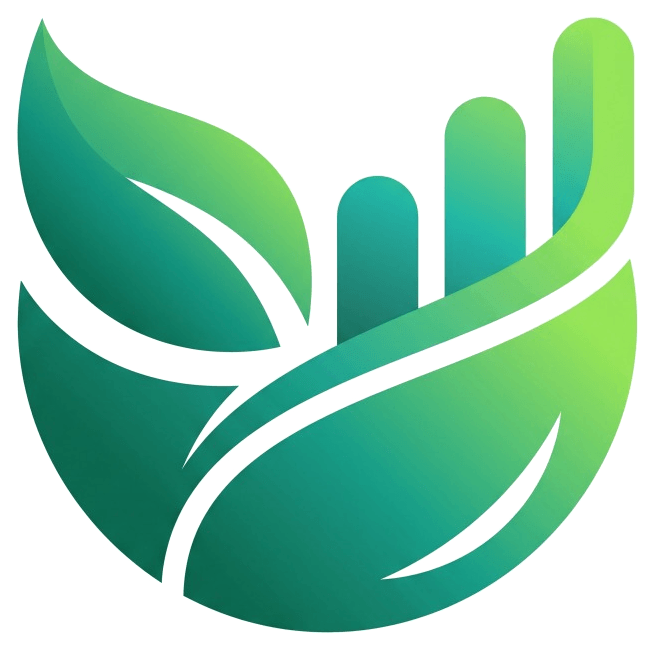

<div align="center">
  
</div>
<div align="center">

# 🌱 FoodWise

### Food Waste Reduction and Food Donation Platform

**Connecting Surplus Food with Communities in Need.**

A web-based platform connecting restaurants, hotels, and households with NGOs to donate surplus food before it is wasted.

<br>

[](https://food-wise-henna.vercel.app)
[](https://nextjs.org/)
[](https://react.dev/)
[](https://www.typescriptlang.org/)
[](https://www.mongodb.com/)
[](https://tailwindcss.com/)

<br>

## 🚀 [Explore the Live Application](https://food-wise-henna.vercel.app)

**Reducing Food Waste • Enabling Food Donations • Supporting Communities**

</div>

---

## 📌 Official Problem Statement

### Title
**Food Waste Reduction and Food Donation Platform**

### Description
> Develop a platform connecting restaurants, hotels, and households with NGOs to donate surplus food before it is wasted.

---

## 🌍 About FoodWise

Food waste and food insecurity are interconnected challenges. Restaurants, hotels, institutional kitchens, and households often have surplus food, while NGOs and charitable organizations work to provide meals to people in need.

However, the lack of effective coordination between food donors and recipient organizations can make timely food redistribution difficult.

**FoodWise bridges this gap through a centralized digital food donation platform.**

It enables food donors to list surplus food, allows NGOs to discover and claim available donations, and provides tools to coordinate collection, track donation progress, and record completed deliveries.

By bringing donors and recipient organizations together, FoodWise aims to make food donation more accessible, organized, and transparent.

### 🎯 Our Mission

To simplify surplus food donation by connecting food donors with NGOs through a centralized, technology-driven platform.

### 💡 Our Vision

A future where surplus food becomes an opportunity to nourish communities rather than unnecessary waste.

---

## 🌐 Live Deployment

FoodWise is deployed on **Vercel** and can be accessed online.

### 🔗 Live Application

**https://food-wise-henna.vercel.app**

Explore the platform to discover its interface, donation workflows, and NGO coordination features.

> **Note:** The availability of individual features depends on the current deployment configuration. Please do not enter sensitive personal information into a demonstration application.

---

## ✨ Key Features

### 🏠 1. Household Food Donations

Households can list surplus food for potential redistribution through participating NGOs.

Features include:
- Food donation forms.
- Food quantity and category information.
- Pickup deadlines.
- Dietary and handling details.
- Donation status tracking.

### 🏨 2. Restaurant and Hotel Donations

Restaurants, hotels, banquet halls, and institutional kitchens can list surplus food generated during their operations.

Features include:
- Structured surplus food listings.
- Food quantity management.
- Collection deadlines.
- Food storage and handling information.
- Dietary and allergen details.
- Pickup instructions.

The platform provides a centralized way for commercial food donors to make available surplus food visible to recipient organizations.

### 🤝 3. NGO Dashboard

NGOs have a dedicated interface for managing food collection and redistribution activities.

Features include:
- Browse available donations.
- Review food details and collection requirements.
- Claim suitable donations.
- Coordinate scheduled pickups.
- Track donation status.
- Record completed deliveries.
- Review relevant notifications.
- Report food quality concerns.

### 🧠 4. Smart Donation Matching

FoodWise includes a rule-based matching system to help NGOs assess available food donations.

Matching considerations include:
- Food quantity.
- Pickup urgency.
- Dietary compatibility.
- Collection requirements.

Matching results are intended to assist users in evaluating donations. They do not guarantee food suitability or safety.

### ⏱️ 5. Donation Lifecycle Management

FoodWise supports structured donation status tracking.

Typical donation states include:

- `AVAILABLE`
- `ACCEPTED`
- `PICKUP`
- `COMPLETED`
- `CANCELLED`
- `FLAGGED_FOR_REVIEW`

The application validates important status transitions to help maintain a consistent donation workflow.

When MongoDB-backed persistence is active, database operations help prevent multiple NGOs from claiming the same available donation simultaneously.

### 🔐 6. Digital Handover Verification

FoodWise includes a four-digit OTP workflow to support the handover of donated food.

The process helps coordinate transfers between donors and recipient organizations.

The OTP supports the handover workflow but does not independently verify participant identity or certify food safety.

### 🥗 7. Food Quality Reporting

NGOs can report food quality concerns encountered during collection or handling.

The reporting workflow supports:
- Incident descriptions.
- Food quality and packaging concerns.
- Severity information.
- Supporting evidence where available.
- Review and follow-up workflows.

This feature helps improve visibility into issues that arise during food redistribution.

### 🤖 8. Foodie AI Assistant

Foodie AI is an AI-powered assistant integrated using the Groq SDK.

It provides contextual guidance to help users understand and navigate the platform.

Potential use cases include:
- Understanding donation workflows.
- Creating food donation listings.
- Navigating NGO operations.
- Understanding donation statuses.
- Accessing platform-related guidance.

Foodie AI is intended to support platform usage. It does not certify food as safe to consume and does not replace qualified food safety professionals.

### 🌐 9. Multilingual Interface

FoodWise includes interface support for:

- English
- Hindi
- Kannada

The multilingual interface aims to make the platform more accessible to users from different linguistic backgrounds.

### 📊 10. Impact Dashboard

The impact dashboard summarizes redistribution activity using application records.

Supported metrics include:
- Food weight recorded as diverted.
- Estimated servings.
- Completed donation activities.
- Donor participation.
- Estimated environmental impact.

Impact figures depend on available records and calculation assumptions. They are not independently audited impact measurements.

### 📄 11. PDF Reports and Certificates

FoodWise includes PDF generation functionality for supported documents, such as:
- Donation records.
- Receipts.
- Certificates.
- Impact reports.

These documents help users maintain records of donation activities.

### 🔔 12. Notifications and Settings

The platform includes:
- In-app notifications.
- Notification read/unread management.
- Role-specific navigation.
- Profile and facility settings.
- Donation and pickup status updates.
- Browser push notification functionality when correctly configured.

### 💾 13. MongoDB Data Persistence

FoodWise integrates MongoDB through the official MongoDB Node.js driver.

The database layer supports persistence for application data, including donations, pickups, notifications, complaints, and related records.

A MongoDB connection must be correctly configured for durable database-backed operation. In-memory fallback data should not be assumed to persist across server restarts.

---

## 🔄 How FoodWise Works

FoodWise follows a structured food donation and redistribution workflow.

```text
┌──────────────────────────────┐
│          FOOD DONORS         │
│                              │
│  Households • Restaurants    │
│       Hotels • Kitchens      │
└──────────────┬───────────────┘
               │
               ▼
┌──────────────────────────────┐
│      LIST SURPLUS FOOD       │
│                              │
│  Quantity • Food Details     │
│  Handling • Pickup Deadline  │
└──────────────┬───────────────┘
               │
               ▼
┌──────────────────────────────┐
│        NGO DASHBOARD         │
│                              │
│  Discover and Review Food    │
│        Donations             │
└──────────────┬───────────────┘
               │
               ▼
┌──────────────────────────────┐
│      CLAIM & COORDINATE      │
│                              │
│    Arrange Food Collection   │
└──────────────┬───────────────┘
               │
               ▼
┌──────────────────────────────┐
│     DIGITAL HANDOVER         │
│                              │
│     Four-Digit OTP Flow      │
└──────────────┬───────────────┘
               │
               ▼
┌──────────────────────────────┐
│     DELIVERY COMPLETION      │
│                              │
│    Update Donation Status    │
└──────────────┬───────────────┘
               │
               ▼
┌──────────────────────────────┐
│      IMPACT & REPORTING      │
│                              │
│  Track Records and Report    │
│       Quality Issues         │
└──────────────────────────────┘
```

### Workflow Overview

1. A household, restaurant, or hotel lists surplus food.
2. The donation becomes available for NGO discovery.
3. An NGO reviews and claims a suitable donation.
4. Pickup arrangements are coordinated.
5. The handover process supports digital OTP verification.
6. The receiving organization records delivery completion.
7. The completed record contributes to applicable impact metrics.
8. Food quality concerns can be reported through the platform.

---

## 🛠️ Technology Stack

| Technology | Purpose |
|---|---|
| Next.js | Full-stack web framework and API routes |
| React | Interactive user interface |
| TypeScript | Type safety and maintainability |
| Tailwind CSS | Responsive styling |
| MongoDB Atlas | Cloud database and persistent storage |
| MongoDB Node.js Driver | Database connectivity and operations |
| Groq SDK | AI assistant integration |
| Motion | Interface animations and transitions |
| Recharts | Data visualization |
| jsPDF | PDF document generation |
| Lucide React | Interface icons |
| Web Push | Browser push notification functionality |
| ESLint | Code quality checks |
| Vercel | Application deployment |

---

## 🏗️ Project Architecture

FoodWise separates its interface, application state, business logic, and database access into organized modules.

```text
FoodWise/
│
├── public/                       # Static assets
│
├── src/
│   ├── app/
│   │   ├── api/                  # Backend API routes
│   │   │   ├── complaints/
│   │   │   ├── data/
│   │   │   ├── donors/
│   │   │   ├── feedback/
│   │   │   ├── foodie-ai/
│   │   │   ├── health/
│   │   │   ├── notifications/
│   │   │   ├── pickups/
│   │   │   ├── push/
│   │   │   └── surplus/
│   │   │
│   │   ├── household/            # Household donor portal
│   │   ├── hotel/                # Restaurant and hotel portal
│   │   ├── ngo/                  # NGO operations portal
│   │   ├── login/
│   │   ├── settings/
│   │   ├── layout.tsx
│   │   └── page.tsx
│   │
│   ├── components/               # Reusable UI components
│   ├── context/                  # Shared application state
│   ├── lib/
│   │   ├── dataService.ts        # Data access layer
│   │   ├── mongodb.ts            # MongoDB connection utility
│   │   ├── mockData.ts           # Demonstration data
│   │   ├── smartMatching.ts      # Donation matching logic
│   │   ├── pdfGenerator.ts       # PDF generation
│   │   ├── pushNotifications.ts  # Push notification utilities
│   │   └── types.ts              # Shared TypeScript types
│   │
│   └── types/                    # Additional type declarations
│
├── .env.example                  # Environment template
├── .gitignore
├── package.json
├── package-lock.json
└── README.md
```

*This is a simplified overview of the project structure. Individual files and directories may evolve during development.*

### Application Data Flow

```text
           User Interface
                 │
                 ▼
         Next.js API Routes
                 │
                 ▼
           Data Service
                 │
                 ▼
           MongoDB Atlas
```

The MongoDB connection and private credentials must remain on the server. Client components should access shared data through the application's API and state-management layers.

---

## 🚀 Getting Started

Follow these steps to run FoodWise locally.

### Prerequisites

Install the following:

- Node.js compatible with the project's Next.js requirements.
- npm.
- Git.
- A MongoDB Atlas account for database persistence.
- A Groq Cloud API key for Foodie AI.

A code editor such as Visual Studio Code or Antigravity is recommended.

### 1. Clone the Repository

```bash
git clone https://github.com/nabeel05-ship-it/FoodWise.git
```

### 2. Navigate to the Project Directory

```bash
cd FoodWise
```

### 3. Install Dependencies

```bash
npm install
```

### 4. Configure Environment Variables

Create a `.env.local` file in the root directory.

Add the following variables:

```env
# MongoDB
MONGODB_URI=
MONGODB_DB_NAME=foodwise

# Groq AI
GROQ_API_KEY=
GROQ_MODEL=openai/gpt-oss-20b

# Web Push Notifications
NEXT_PUBLIC_VAPID_PUBLIC_KEY=
VAPID_PRIVATE_KEY=
```

#### MongoDB Configuration

1. Create a MongoDB Atlas project and cluster.
2. Create a database user with appropriate permissions.
3. Configure network access.
4. Obtain the MongoDB Node.js driver connection string.
5. Set the connection string as the value of `MONGODB_URI`.

Example format:

```env
MONGODB_URI=mongodb+srv://<username>:<password>@<cluster-host>/foodwise?retryWrites=true&w=majority
```

Replace the placeholders with your actual Atlas connection details.

#### Foodie AI Configuration

1. Access your Groq Cloud account.
2. Generate an API key.
3. Set it as `GROQ_API_KEY`.
4. Ensure `GROQ_MODEL` uses a model identifier supported by your account.

#### Push Notification Configuration

Browser push functionality requires a valid VAPID public/private key pair when enabled.

Keep the private key secret. Never commit `.env.local` or actual environment values to GitHub.

### 5. Run the Development Server

```bash
npm run dev
```

Open the application at:

**http://localhost:3000**

### 6. Run Code Quality Checks

Run lint:

```bash
npm run lint
```

Build the application:

```bash
npm run build
```

Resolve build errors before deploying.

---

## 🧪 Testing and Verification

Before sharing a deployment, verify the application's main workflows.

### Recommended Checklist

- [ ] Create a household donation.
- [ ] Create a restaurant or hotel donation.
- [ ] View available donations as an NGO.
- [ ] Claim an available donation.
- [ ] Coordinate a pickup.
- [ ] Complete the handover workflow.
- [ ] Record delivery completion.
- [ ] Submit a food quality report.
- [ ] Verify notification behavior.
- [ ] Verify impact dashboard calculations.
- [ ] Test PDF generation.
- [ ] Test English, Hindi, and Kannada language switching.
- [ ] Test Foodie AI with a valid Groq API key.
- [ ] Verify MongoDB persistence after a page refresh.
- [ ] Verify persisted records after restarting the local server.
- [ ] Run `npm run lint`.
- [ ] Run `npm run build`.

### Health Check

FoodWise includes a health-check endpoint.

When running locally, visit:

```text
http://localhost:3000/api/health
```

For the deployed application, visit:

**https://food-wise-henna.vercel.app/api/health**

Review the response to check application health and MongoDB connectivity.

A successful health check does not guarantee that every user workflow works correctly.

---

## ☁️ Deployment

FoodWise is deployed on **Vercel**.

### 🌐 Live URL

**https://food-wise-henna.vercel.app**

### Deployment Configuration

To deploy your own instance:

1. Push the project to GitHub.
2. Import the repository into Vercel.
3. Configure the required environment variables.
4. Verify MongoDB Atlas connectivity.
5. Deploy the application.
6. Review build and runtime logs.
7. Test the main donation workflows on the deployed URL.

### Required Environment Variables

Configure applicable variables under:

**Vercel → Project Settings → Environment Variables**

| Variable | Purpose |
|---|---|
| `MONGODB_URI` | MongoDB connection string |
| `MONGODB_DB_NAME` | Optional database name override |
| `GROQ_API_KEY` | Foodie AI authentication |
| `GROQ_MODEL` | Optional AI model override |
| `NEXT_PUBLIC_VAPID_PUBLIC_KEY` | Browser push subscriptions |
| `VAPID_PRIVATE_KEY` | Server-side push signing |

Use actual provider credentials in deployment settings. Never add secrets to this README.

MongoDB Atlas network access must also permit the deployed application to connect to the database.

---

## 🔐 Security and Limitations

FoodWise is a software prototype intended for demonstration, evaluation, and continued development.

### Authentication and Authorization

The current authentication/session approach uses client-side role state and local storage rather than a complete production-grade authentication system with cryptographically verified server sessions.

Additional server-side authentication and authorization controls are necessary before using the platform for sensitive real-world operations.

### Data Persistence

MongoDB-backed persistence requires a valid connection string and correct configuration.

If the application uses its in-memory fallback, data may be lost when the server process restarts. Shared application data should be verified against MongoDB before relying on its persistence.

### Food Safety

FoodWise facilitates donation coordination but does not guarantee that donated food is safe to consume.

Donors and recipient organizations must follow applicable food safety, storage, transportation, and handling requirements.

### AI Limitations

Foodie AI may produce inaccurate responses. Its output should not be treated as professional food safety advice.

### Production Readiness

Before production use, the application should undergo a security review, stronger authentication implementation, API authorization testing, privacy assessment, and end-to-end workflow verification.

---

## 🔮 Future Enhancements

Potential future improvements include:

- Secure authentication and session management.
- More comprehensive server-side authorization.
- Enhanced donation matching and recommendations.
- Improved food quality traceability.
- Advanced reporting and analytics.
- More reliable notification delivery.
- Accessibility improvements.
- Expanded automated testing.
- Integrations with institutional kitchens and food service systems.
- Improved monitoring, backup, and recovery procedures.

These are potential enhancements and are not claims of already implemented functionality.

---

## 🌱 Expected Impact

FoodWise aims to support a more efficient and coordinated approach to surplus food redistribution.

The platform seeks to:

- Reduce avoidable food waste.
- Improve the visibility of available surplus food.
- Simplify donation and collection coordination.
- Support timely food redistribution.
- Improve transparency in donation workflows.
- Encourage responsible food management.
- Support NGOs working to address food insecurity.

Actual impact depends on user adoption, operational execution, food suitability, and successful completion of donation workflows.

---

## 🤝 Contributing

Contributions, suggestions, and improvements are welcome.

To contribute:

1. Fork the repository.
2. Create a feature branch.
3. Make your changes.
4. Run the available lint and build checks.
5. Submit a pull request with a clear description of your changes.

Please avoid committing secrets, confidential information, or unrelated generated files.

---

## 👨‍💻 Project Information

| Field | Details |
|---|---|
| Project Name | FoodWise |
| Official Problem Statement | Food Waste Reduction and Food Donation Platform |
| Problem Description | Develop a platform connecting restaurants, hotels, and households with NGOs to donate surplus food before it is wasted. |
| Domain | Food Waste Reduction and Food Donation |
| Application Type | Full-Stack Web Application |
| Frontend | Next.js, React, TypeScript, Tailwind CSS |
| Database | MongoDB |
| AI Integration | Groq |
| Deployment | Vercel |

### 🔗 Important Links

- **Live Application:** https://food-wise-henna.vercel.app
- **GitHub Repository:** https://github.com/nabeel05-ship-it/FoodWise
- **MongoDB Atlas:** https://www.mongodb.com/atlas
- **Groq Cloud:** https://console.groq.com/
- **Vercel:** https://vercel.com/

---

## 📄 License

No open-source license has been specified in this README.

Unless a license is added to the repository, users should not assume that the project is available for unrestricted reuse, redistribution, or commercial use.

---

<div align="center">

## 🌱 FoodWise

### Less Waste. More Nourishment. Stronger Communities.

**Connecting surplus food with the organizations working to get it to people in need.**

[**Visit FoodWise →**](https://food-wise-henna.vercel.app)

</div>
